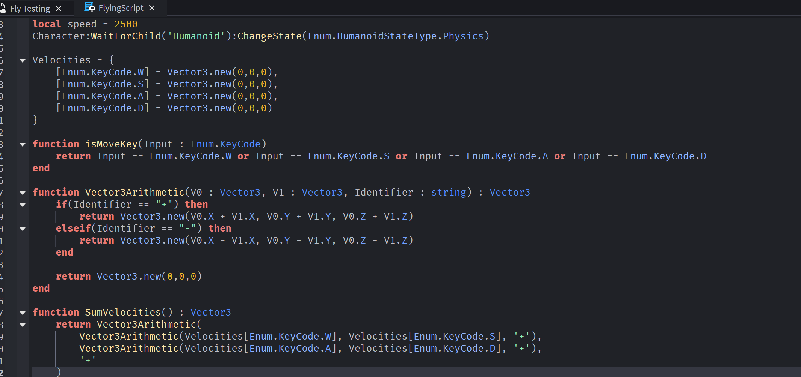
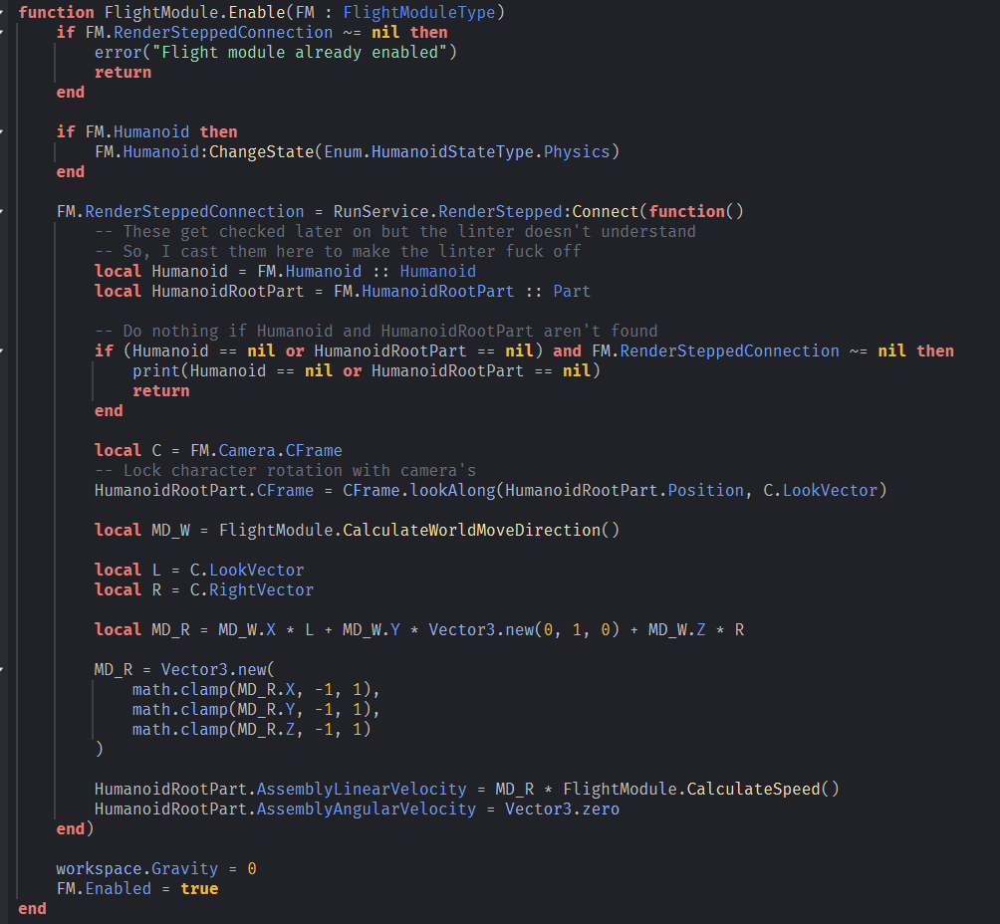

# Why Make This?

This was a quick remake of an old script I made which was hideous. Also it's practice for writing a detailed README file. (Mostly the README) 

 Unfortunately, I did not save the entirety of the old script. (I never thought I'd need it again) 

# Improvements
Also, I felt that SumVelocities function was bad when I wrote it and now I have a better solution

